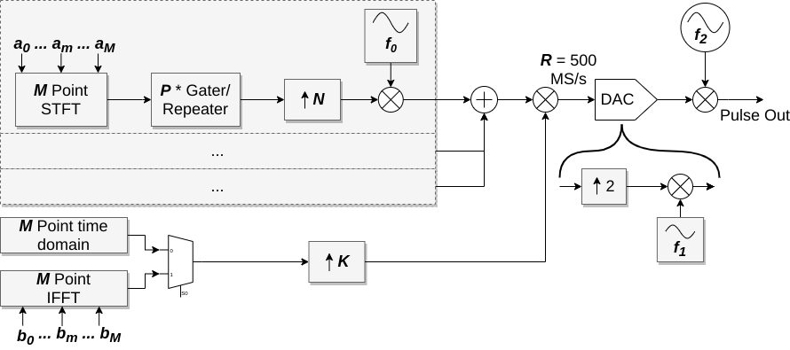

# Phaser_STFT_Pulsegen
Development of an STFT (short time fourier transform) pulse-generator architecture for the Phaser hardware.

(Block diagram is subject to change)

## Overview

A general purpose digital quantum computer needs to perform operations with multiple qbits. In a trapped ion system the qbits are represented by energy levels of an ion electron. For a multi ion quantum gate the electrons state needs to be entangled with the state of the electron in another ion. This can be achieved by coupling the electrons to a shared motional (vibrational) mode of the ions. In order to do so, the ions need to be exposed to a modulated driving field, the shape of which might be easily specified with a few parameters in frequency space. This would result in a faster, scalable and more elegant solution than driving the field with a precomputed waveform played back on an AWG.

## Discussion and Prototypes

There have been a number of [discussions](https://github.com/quartiq/phaser/issues/2) on the topic. An outline of the architecture is drafted in the [STFT pulsegen prototype](STFT_Pulsegen_for_Quantum_Gates.ipynb) notebook.
Another (very raw) exemplification of some DFT and time-domain relations is given in [Shape and Tone FFT](Shape_and_Tone_FFT.ipynb).

## Development

The architecture will be deployed on the [Phaser](https://github.com/sinara-hw/Phaser/wiki) hardware of the Sinara ecosystem and will eventually be controlled through [Artiq](https://github.com/m-labs/artiq).

It will be developed in [migen](https://github.com/m-labs/migen) FHDL and the intent is to build parameterizable and scalable code. Cores to be developed:

- FFT
- Half-band filters
- CIC filter
- DDS
- Artiq communication
